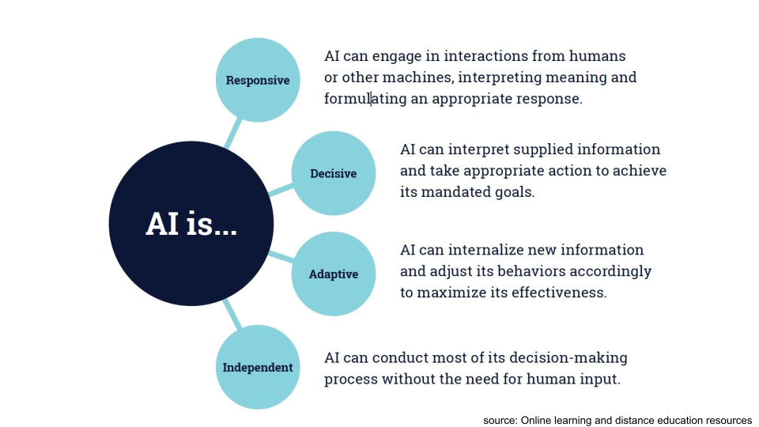
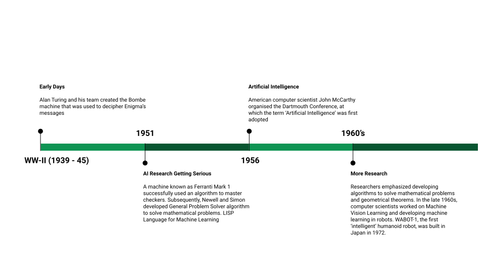
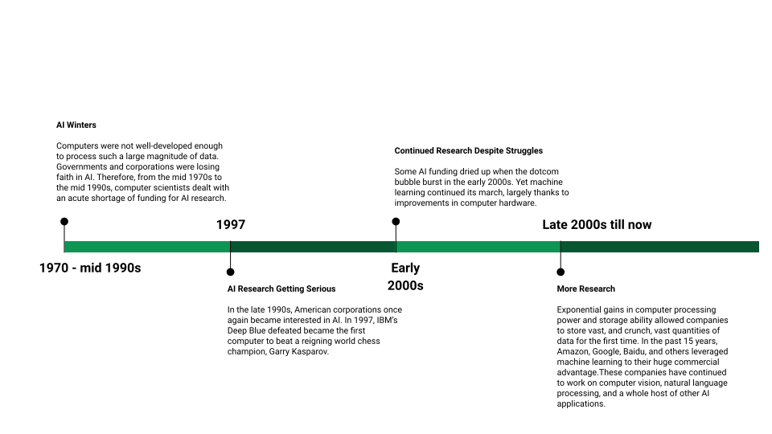

# Introduction to Artificial Intelligence

```
Einav Grinberg, Muhammad Saad Saif, Anna Formaniuk
```

## Overview

### Objective

After completing this tutorial, readers will

- Get familiar with the basic concepts of AI

```
● What is AI? - 5 minutes
● How should we define AI? - 5 minutes
● Related fields - 5 minutes
● History of AI - 5 minutes
● Alan Turing and The Turing Test - 5 minutes
● Applications of AI in different areas - 10 minutes
● Tasks - 10-15 minutes
```

---

## What is Artificial Intelligence?

Before we begin, take a piece of paper or open a document on your
computer and try to write down key words that define AI,
by viewing [this video by the BBC](https://www.bbc.com/news/av/technology-34224406/what-is-artificial-intelligence).

---


## How should we define AI?

_“Artificial intelligence (AI), the ability of a digital computer or computer-controlled
robot to perform tasks commonly associated with intelligent beings.”
(Encyclopaedia Britannica)_

What characteristics do intelligent beings (such as humans) have?

```
● Learning and generalizing
● Ability to reason
● Discover meaning using common language
● Solve problems
```


---

## Related Fields

**Computer Science** - A study of computers, science, and programming stuff

**Artificial Intelligence** - Explained above

**Machine Learning** - Systems that improve their performance in a given task with
more and more experience or data.

**Deep Learning** - Machine learning based on Artificial Neural Networks

**Data Science** - Science of extracting knowledge from data


## Related Fields - Taxonomy!

Click on the link and take the quiz -

https://forms.gle/Prz9Zf8Egx7WZTVW7

---


## History of Artificial Intelligence





## Alan Turing

“ _the father of theoretical computer science and artificial intelligence_ ”

Alan Turing (1912-1954) was an English mathematician
and logician.
Turing was fascinated by intelligence and thinking, and
the possibility of simulating them by machines.
Turing’s most prominent contribution to AI is his
imitation game, which later became known as the
**Turing test.**

### The Turing Test

<p align="center">
  
</p>

A human interrogator interacts with two players, A and B,
by exchanging written messages (in a chat).
If the interrogator cannot determine which player,
A or B, is a computer and which is a human,
the computer is said to pass the test.

Click on the [link](https://www.bbc.com/news/technology-27762088) to see how a computer program called Eugene Goostman, which simulates a 13-year-old Ukrainian boy, is said to have passed the Turing test at an event organised by the University of Reading.

---

## Applications of Artificial Intelligence


### Media and Internet

● Image/Video classification

● Speech recognition and real time translation

● Content-based search


#### AI can be used to generate or alter visual content

1. Style transfer, which adapts a picture to make it look like painted by Vincent van Gogh
2. Computer-generated characters in motion pictures
3. Animations, where the animated character replicates gestures made by real human actors

_It will be easy to create natural looking fake videos of events and people_

---

### Speech recognition

Examples here are:
1. Smart Speaker and Smart Home: Amazon Echo and Alexa, Google Home and Microsoft Cortana
2. Mobile Device Applications: Apple’s Siri and Facebook’s speech recognition integrations.

They can be used for various purposes:
- help manage schedule, keep track of tasks, and set reminders
- control apps and home devices: play music, buy things, turn on the TV, order food
- analyze audio files and return transcribed speech


#### Content recommendation is widely used today to offer personalized content. Examples are:

1. Facebook, Twitter, Instagram, other social media content
2. Online advertisements and search engines
3. Music recommendations on Spotify
4. Movie recommendations on Netflix
5. Online publishers

_Be aware of possible implications: filter bubbles, echo-chambers, troll factories,
fake news, and new forms of propaganda_

---

### Medicine

● Cancer cell detection

● Diabetic grading

● Drug discovery


#### Helping doctors to diagnose patients

Since there is plenty of good data available in these cases, algorithms are becoming just as good at diagnostics as the experts and can make a decision in a fraction of a second.


#### Developing drugs faster

AI can help faster identify target proteins, discover drug candidates (compound that can interact with the identified target molecule), find suitable candidates for clinical trials, automate a large portion of the manual work and speed up the process.


#### Personalizing treatment through...

1. going through personal record of the patient
2. analysing enormous amounts of statistical data of all other patients
3. predicting a patient’s probable response to all particular treatments, assessing all possible risks and benefits
4. designing the best treatment plan, tailored specifically to the patient

---

### Security and defence

● Face recognition

● Video surveillance

● Cyber security


#### Face recognition

is already used in many customer, business, and government applications such as

1. organizing your photos according to people
2. automatic tagging on social media
3. passport control


#### Video surveillance

is able to recognize humans, vehicles, objects and events. Through this it is also possible to classify mood, behaviour, and detect dangerous situations.

---

### Autonomous machines

● Pedestrian detection

● Lane tracking

● Traffic signs recognition

● Routing


#### Self-driving cars require a combination of AI techniques of many kinds:

1. search and planning to find the most convenient route from A to B
2. computer vision to identify obstacles, lane, traffic signs, pedestrians
3. decision making under uncertainty to cope with the complex and dynamic environment.

_Very likely in the future machines will take care of the driving, while people will keep an eye
on them._

```
Each of these must work with flawless precision in order to avoid accidents!
```

The same applies to other autonomous systems such as delivery robots, flying drones, and autonomous ships.

---

## Tasks

### Answer these 2 questions and send us an e-mail to aihackathon@gmail.com!

1. Choose which of the following are AI and which are not:
    a. Spreadsheet that calculates sums and other pre-defined functions on given data
    b. Predicting the stock market by fitting a curve to past data about stock prices
    c. A GPS navigation system for finding the fastest route
    d. A music recommendation system such as Spotify that suggests music based on the users'
       listening behavior
    e. Big data storage solutions that can store huge amounts of data (such as images or video) and
       stream them to many users at the same time
    f. Photo editing features such as brightness and contrast in applications such as Photoshop
    g. Style transfer filters in applications such as Prisma that take a photo and transform it into
       different art styles (impressionist, cubist, ...)
2. Tell us, what an AI you would like to have, that would make your life better.

---

## References

```
● Elements of AI, Helsinki University - https://course.elementsofai.com/
● What is artificial intelligence? -
https://www.bbc.com/news/av/technology-34224406/what-is-artificial-intelligence
● Computer AI passes Turing test in 'world first' - https://www.bbc.com/news/technology-27762088
● History of AI - https://towardsdatascience.com/history-of-ai-484a86fc16ef
● AI for Speech Recognition – Current Companies, Technology, and Trends -
https://emerj.com/ai-sector-overviews/ai-for-speech-recognition/
● Artificial Intelligence in Medicine -
https://www.datarevenue.com/en-blog/artificial-intelligence-in-medicine
● How Artificial Intelligence Might Personalize Healthcare -
https://www.siemens-healthineers.com/news/mso-column-ai-personalizing-healthcare.html
● Pictures for General free use in https://unsplash.com/
```

