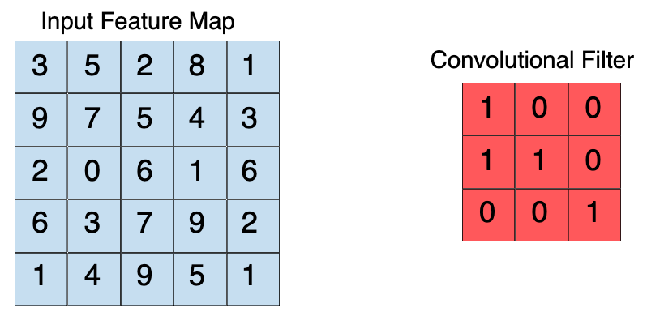
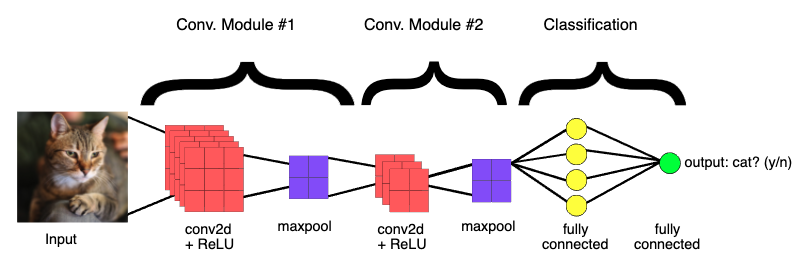

# Theory behind Image Classification

```
Einav Grinberg, Muhammad Saad Saif, Anna Formaniuk
```

## Overview

```
● What is an image and how can we recognize images? 
● Machine approaches to image recognition
● What are Neural Networks
● Convolutional Neural Networks (CNN) for Image Classification

```
---

In the previous tutorial we found out that we can use Artificiall Intelligence for image recognition. In this one we are going to go through how that is possible and get an intuitive understanding of what is going on there.

## What is an image and how can we recognize images? 

A **digital image** is simply a collection of points on the screen, also called pixels. The resolution of an image is defined by how many pixels it consists of and their width to height proportion. The more pixels per centimeter - the clearer and sharper the image looks. If we have an RGB (Red-Green-Blue) image, each pixel has three values, corresponding to each of the colours. The higher the value - the more intense the colour. Often these values are within the range of 0 and 255. Thus, for instance (255, 0, 0) would give us the red colour, (0, 255, 0) - green, and (0, 0, 255) - blue. (0, 0, 0) is black and (255, 255, 255) is white. Combining them is similar to combining paints when you draw: (128, 0, 128) - a combination of red and blue would result in a purple colour!

Humans can easily recognize what is inside the image by just looking at it if we have previously learned what those objects are. Computers also at first have to learn the object before they can recognize it on an image. And for this they need exactly what a digital image consists of - the pixels. Everything else we want them to know we have to describe in term of pixels.

---

## Machine approaches to image recognition

- Early Computer Vision models only used the raw pixels as input. But then the results heavily relied on the position of the object, the background, lightning, camera focus, etc.
- Then the Machine Learning models integrated features to derive from pixel data: textures, shapes, edges, and color distributions. There are many different ways to train a classifier once we defined the features and the choice depends on the data you are dealing with.
- Deep Learning works differently: instead of providing a set of instructions, we provide examples: we give the computer a thousand images of bread and a thousand images of cake and ask it to learn the difference. While learning, it decides by itself which features are important and which are not. Then we show it an image it has not seen before and let it decide if it's a bread or a cake. 

The question ofen is whether to use Machine learning or Deep learning. The decision comes down to two factors: 
1. How many images do we have to train the classifier?
2. What hardware resources are available? - Deep Learning takes a lot of time!
If we have a lot of data and resources we should go with Deep learning, as then it has all the chances to be more accurate. Otherwise we should choose a Machine Learning approach and extract important features ourselves.

More to this topic can be found in [this video](https://www.youtube.com/watch?v=-SgkLEuhfbg).

---

Since Deep Learning is more accurate (and nowadays also more popular), we're going to proceed with it! As you may remember from the first tutorial, Deep Learning is a subfield of Machine Learning concerned with algorithms inspired by the human brain, called artificial neural networks.

## So what is a Neural Network?

To get an intuitive understanding how it works, let's first look at its components:

### Layers

Neural networks are also called “stacked neural networks”, meaning networks composed of several layers. The layers are made of nodes. On the following image you can see an example of a simple neural network, that consists of the input layer, one hidden layer and the output layer, that has only two possible outcomes. The input layer consists of nodes that get their values directly from the data. Each next layer's output serves as the subsequent layer's input, thus **feeding forward** information. The output represents the combined input of all the nodes. 
If a neural network has more than 1 hidden layer, it is called deep.


### Nodes


**Weights and inputs**

Similarly to the neurons in a human brain, the nodes are linked together and fire when receive enough stimuli from the other nodes. The nodes both process and store information. As seen on the image, the node takes inputs from the preceding nodes, combines them with a set of coefficients (weights), that either increase or decrease importance of each input, and sums it all up. 

**Activations and outputs**

Then the computed sum is then passed to the activation function, which decides what value in the range from 0 to 1 to store in the node as a result. The closer the value is to 1, the more "activated" it becomes.
The output then becomes the next layer's input or, if it's the output layer, is used to extract a prediction or a decision from the neural network. The most activated node is then the most probable outcome.

### Training a neural network

So to be able to classify something, we need the following elements: input data, weights, and an activation function. The first is provided, the last we choose from the available functions and to have the weights we need to train the network. To train it we can provide labels for each item in our training data, or just let the network find some patterns and features automatically, draw connections between them and distinguish various classes by itself. Training it on labeled data can be more performative, as the network will be comparing its results to the results we want it to achieve and adjusting the weights accordingly. This is done through forward propagation and back propagation.

The goal of training the network is to have the labels predicted by the network as close to the real labels as possible. In other words, we must minimize the difference between them, also called the error.
At first all the weights are initialized randomly. Each next step involves an error measurement and a slight update of the weights, as the network slowly learns from its mistakes and is repeated until the least possible error is achieved. A final collection of weights is then called a **model**.

This can be generalized as follows:

Input enters the network. The summary of inputs multiplied by the weights is passed throught he activation function and a set of guesses is made.

```
input * weight = guess
```

Then the guess is compared to the ground-truth about the data (the labels we provide), effectively asking “Did I get this right?”. This answer to this question is provided by what is called a **cost function**

```
ground truth - guess = error
```

The difference between the network’s guess and the ground truth is its error. The network measures that error, and walks the error back over its model, adjusting weights to the extent that they contributed to the error. Some details on this will be explained in the following chapter.

```
error * weight's contribution to error = adjustment
```

#### Gradient Descent

To compare the guess with the ground truth and optimize the weights, "Gradient descent" is applied. Gradient basically represents how two or more variables relate to each other: in this case - the relationship between the network’s error and the weights. With the gradient it is possible to see how increasing or decreasing a weight by one step affects the error and then to choose the option that makes it smaller. This is done recursively for all the weights in the model and in the end the essence of learning in deep learning is nothing more than that: adjusting a model’s weights in response to the error it produces, until you can’t reduce the error any more. Going back through the network to adjust the weights is a technique called **backpropagation**.


---

The neural networks used 
## Convolutional Neural Networks (CNN) for Image Classification 

A breakthrough in building models for image classification came with the discovery that a convolutional neural network (CNN) could be used to progressively extract higher- and higher-level representations of the image content. Instead of preprocessing the data to derive features like textures and shapes, a CNN takes just the image's raw pixel data as input and "learns" how to extract these features, and ultimately infer what object they constitute.

To start, the CNN receives an input feature map: a three-dimensional matrix where the size of the first two dimensions corresponds to the length and width of the images in pixels. The size of the third dimension is 3 (corresponding to the 3 channels of a color image: red, green, and blue). The CNN comprises a stack of modules, each of which performs three operations.

### 1. Convolution
A convolution extracts tiles of the input feature map, and applies filters to them to compute new features, producing an output feature map, or convolved feature (which may have a different size and depth than the input feature map). Convolutions are defined by two parameters:

- Size of the tiles that are extracted (typically 3x3 or 5x5 pixels).
- The depth of the output feature map, which corresponds to the number of filters that are applied.

During a convolution, the filters (matrices the same size as the tile size) effectively slide over the input feature map's grid horizontally and vertically, one pixel at a time, extracting each corresponding tile (see Figure 3).


Figure 3. A 3x3 convolution of depth 1 performed over a 5x5 input feature map, also of depth 1. There are nine possible 3x3 locations to extract tiles from the 5x5 feature map, so this convolution produces a 3x3 output feature map.

For each filter-tile pair, the CNN performs element-wise multiplication of the filter matrix and the tile matrix, and then sums all the elements of the resulting matrix to get a single value. Each of these resulting values for every filter-tile pair is then output in the convolved feature matrix (see Figures 4a and 4b).



Figure 4a. Left: A 5x5 input feature map (depth 1). Right: a 3x3 convolution (depth 1).


Figure 4b. Left: The 3x3 convolution is performed on the 5x5 input feature map. Right: the resulting convolved feature. Click on a value in the output feature map to see how it was calculated.

During training, the CNN "learns" the optimal values for the filter matrices that enable it to extract meaningful features (textures, edges, shapes) from the input feature map. As the number of filters (output feature map depth) applied to the input increases, so does the number of features the CNN can extract. However, the tradeoff is that filters compose the majority of resources expended by the CNN, so training time also increases as more filters are added. Additionally, each filter added to the network provides less incremental value than the previous one, so engineers aim to construct networks that use the minimum number of filters needed to extract the features necessary for accurate image classification.

### 2. ReLU

Following each convolution operation, the CNN applies a Rectified Linear Unit (ReLU) transformation to the convolved feature, in order to introduce nonlinearity into the model. The ReLU function, , returns x for all values of x > 0, and returns 0 for all values of x ≤ 0.

### 3. Pooling
After ReLU comes a pooling step, in which the CNN downsamples the convolved feature (to save on processing time), reducing the number of dimensions of the feature map, while still preserving the most critical feature information. A common algorithm used for this process is called max pooling.

Max pooling operates in a similar fashion to convolution. We slide over the feature map and extract tiles of a specified size. For each tile, the maximum value is output to a new feature map, and all other values are discarded. Max pooling operations take two parameters:

- Size of the max-pooling filter (typically 2x2 pixels)
- Stride: the distance, in pixels, separating each extracted tile. Unlike with convolution, where filters slide over the feature map pixel by pixel, in max pooling, the stride determines the locations where each tile is extracted. For a 2x2 filter, a stride of 2 specifies that the max pooling operation will extract all nonoverlapping 2x2 tiles from the feature map (see Figure 5).


Figure 5. Left: Max pooling performed over a 4x4 feature map with a 2x2 filter and stride of 2. Right: the output of the max pooling operation. Note the resulting feature map is now 2x2, preserving only the maximum values from each tile.

### Fully Connected Layers
At the end of a convolutional neural network are one or more fully connected layers (when two layers are "fully connected," every node in the first layer is connected to every node in the second layer). Their job is to perform classification based on the features extracted by the convolutions. Typically, the final fully connected layer contains a softmax activation function, which outputs a probability value from 0 to 1 for each of the classification labels the model is trying to predict.

Figure 6 illustrates the end-to-end structure of a convolutional neural network.


Figure 6. The CNN shown here contains two convolution modules (convolution + ReLU + pooling) for feature extraction, and two fully connected layers for classification. Other CNNs may contain larger or smaller numbers of convolutional modules, and greater or fewer fully connected layers. Engineers often experiment to figure out the configuration that produces the best results for their model.


## References

```
● Elements of AI, Helsinki University - https://course.elementsofai.com/
● A Beginner's Guide to Neural Networks and Deep Learning -
https://pathmind.com/wiki/neural-network
● Machine Learning Glossary - https://ml-cheatsheet.readthedocs.io/en/latest/
```