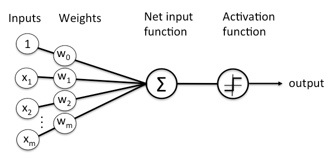

# The Maths behind a Neural Network

```
Einav Grinberg, Muhammad Saad Saif, Anna Formaniuk
```

## Overview

```
● What are the elements of a Neural Network?
● Training a neural network
●

```
---

## What are the elements of a Neural Network?

### Layers

Neural networks are also called “stacked neural networks”, meaning networks composed of several layers. The layers are made of nodes. On the following image you can see an example of a simple neural network, that consists of the input layer, one hidden layer and the output layer, that has only two possible outcomes. The input layer consists of nods that get their values directly from the data. Each next layer's output serves as the subsequent layer's input.
If a neural network has more than 1 hidden layer, it is called deep.


### Nodes



**Weights and inputs**

Similarly to the neurons in a human brain, the nodes are linked together and fire when receive enough stimuli from the other nodes. The nodes both process and store information. As seen on the image, the node takes inputs from the preceding nodes, combines them with a set of coefficients (weights), that either increase or decrease importance of each input, and sums it all up. 

**Activations and outputs**

Then the computed sum is then passed to the activation function, which decides what value in the range from 0 to 1 to store in the node as a result. The closer the value is to 1, the more "activated" it becomes.
The output then becomes the next layer's input or, if it's the output layer, is used to extract a prediction or a decision from the neural network. The most activated node is then the most probable outcome.

---

## Training a neural network

So to be able to classify something, we need the following elements: input data, weights, and an activation function. The first is provided, the last we choose from the available functions and to have the weights we need to train the network. To train it we can provide labels for each item in our training data, or just let the network find some patterns and features automatically, draw connections between them and distinguish various classes by itself. Training it on labeled data can be more performative, as the network will be comparing its results to the results we want it to achieve and adjusting the weights accordingly. This is done through forward propagation and back propagation.

The goal of training the network is to have the labels predicted by the network as close to the real labels as possible. In other words, we must minimize the difference between them, also called the error.
At first all the weights are initialized randomly. Each next step involves an error measurement and a slight update of the weights, as the network slowly learns from its mistakes and is repeated until the least possible error is achieved. A final collection of weights is then called a **model**.

This can be generalized as follows:

Input enters the network. The summary of inputs multiplied by the weights is passed throught he activation function and a set of guesses is made.

```
input * weight = guess
```

Then the guess is compared to the ground-truth about the data (the labels we provide), effectively asking “Did I get this right?”.

```
ground truth - guess = error
```

The difference between the network’s guess and the ground truth is its error. The network measures that error, and walks the error back over its model, adjusting weights to the extent that they contributed to the error.

```
error * weight's contribution to error = adjustment
```


## References

```
● Elements of AI, Helsinki University - https://course.elementsofai.com/
● A Beginner's Guide to Neural Networks and Deep Learning -
https://pathmind.com/wiki/neural-network
● 
```