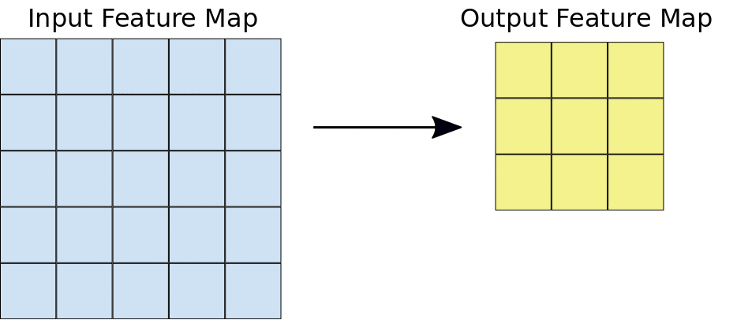
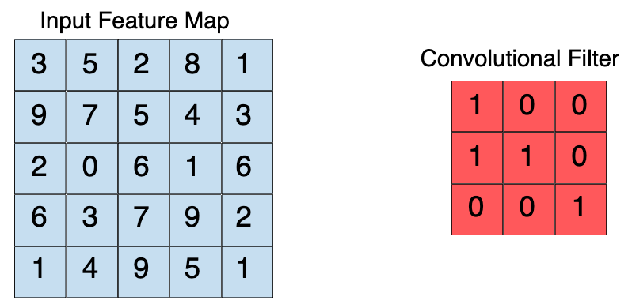
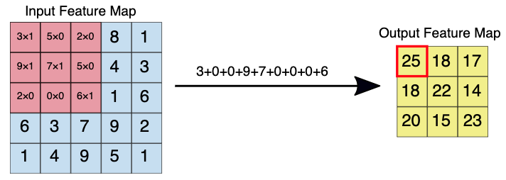
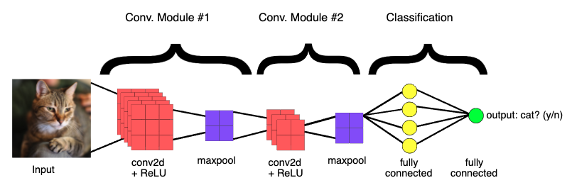

# Theory behind Image Classification

```
Einav Grinberg, Muhammad Saad Saif, Anna Formaniuk
```

## Overview

```
● What is an image and how can we recognize images? 
● Machine approaches to image recognition
● What are Neural Networks
● Convolutional Neural Networks for Image Classification
```

---

In the previous tutorial, we found out that we can use Artificial Intelligence for image recognition. In the following tutorial, we will discuss how it is possible and get an intuitive understanding of what AI is for image recognition.

## What is an image and how can we recognize images? 

A **digital image** is simply a collection of points on the screen, also called pixels. The resolution of an image is defined by how many pixels it consists of and their width to height proportion. The more pixels per centimeter - the clearer and sharper the image looks. If we have an RGB (Red-Green-Blue) image, each pixel has three values, corresponding to each of the colours. The higher the value - the more intense the colour. Often these values are within the range of 0 and 255. Thus, for instance (255, 0, 0) would give us the red colour, (0, 255, 0) - green, and (0, 0, 255) - blue. (0, 0, 0) is black and (255, 255, 255) is white. Combining them is similar to combining paints when you draw: (128, 0, 128) - a combination of red and blue would result in a purple colour!

Humans can easily recognize what is inside the image by just looking at it if we have previously learned what those objects are. Computers also at first have to learn the object before they can recognize it on an image. And for this, they need exactly what a digital image consists of - the pixels. Everything else we want them to know we have to describe in terms of pixels.

---

## Machine approaches to image recognition

- Early Computer Vision models only used raw pixels as input. But then the results heavily relied on the position of the object, the background, lighting, camera focus, etc.
- Then the Machine Learning models integrated features to derive from pixel data: textures, shapes, edges, and color distributions. There are many different ways to train a classifier once we defined the features and the choice depends on the data you are dealing with.
- Deep Learning works differently: instead of providing a set of instructions, we provide examples: we give the computer a thousand images of bread and a thousand images of cake and ask it to learn the difference. While learning, it decides by itself which features are important and which are not. Then we show it an image it has not seen before and let it decide if it's a bread or a cake. 

The question often is whether to use Machine Learning or Deep Learning. The decision comes down to two factors: 
1. How many images do we have to train the classifier?
2. What hardware resources are available? - Deep Learning takes a lot of time!
If we have a lot of data and resources we should go with Deep learning, as then it has all the chances to be more accurate. Otherwise, we should choose a Machine Learning approach and extract important features ourselves.

More to this topic can be found in [this video](https://www.youtube.com/watch?v=-SgkLEuhfbg).

---

Since Deep Learning is more accurate (and nowadays also more popular), we're going to proceed with it! As you may remember from the first tutorial, Deep Learning is a subfield of Machine Learning concerned with algorithms inspired by the human brain, called artificial neural networks.

## So what is a Neural Network?

To get an intuitive understanding how it works, let's first look at its components:

### Layers

Neural networks are also called “stacked neural networks”, meaning networks that are composed of several layers. The layers are made of nodes. In the following image, you can see an example of a simple neural network that consists of the input layer, one hidden layer, and the output layer, which has only two possible outcomes. The input layer consists of nodes that get their values directly from the data. Each next layer's output serves as the subsequent layer's input, thus **feeding forward** information. The output represents the combined input of all the nodes. 
If a neural network has more than 1 hidden layer, it is called deep.


### Nodes


**Weights and inputs**

Similarly to the neurons in a human brain, the nodes are linked together and fire when they receive enough stimuli from the other nodes. The nodes, both process, and store information. As seen on the image, the node takes inputs from the preceding nodes, combines them with a set of coefficients (weights), that either increase or decrease the importance of each input, and sums it all up. 

**Activations and outputs**

The computed sum is then passed to the activation function, which decides what value in the range from 0 to 1 to store in the node as a result. The closer the value is to 1, the more **activated** it becomes.
The output then becomes the next layer's input or, if it's the output layer, is used to extract a prediction or a decision from the neural network. The most activated node is then the most probable outcome.

### Training a neural network

So to be able to classify something, we need the following elements: input data, weights, and an activation function. The first element is provided, the last element we choose from the available functions, and to get the weights we need to train the network. To train the network we can provide labels for each item in our training data, or just let the network find some patterns and features automatically, draw connections between them, and distinguish various classes by itself. Training it on labeled data can be more performative, as the network will be comparing its results to the results we want it to achieve and adjusting the weights accordingly. 

The goal of training the network is to have the labels predicted by the network as close to the real labels as possible. In other words, we must minimize the difference between them, also called the error.
At first, all the weights are initialized randomly. Each next step involves an error measurement and a slight update of the weights, as the network slowly learns from its mistakes and is repeated until the least possible error is achieved. A final collection of weights is then called a **model**.

This can be generalized as follows:

Input enters the network. The summary of inputs multiplied by the weights is passed through the activation function and a set of guesses are made.

```
input * weight = guess
```

Then the guess is compared to the ground-truth about the data (the labels we provide), effectively asking “Did I get this right?”. This answer to this question is provided by what is called a **cost function**

```
ground truth - guess = error
```

The difference between the network’s guess and the ground truth is its error. The network measures that error, and walks the error back over its model, adjusting weights to the extent that they contributed to the error. Some details on this will be explained in the following paragraph.

```
error * weight's contribution to error = adjustment
```

#### Gradient Descent

To compare the guess with the ground truth and optimize the weights, “Gradient descent” is applied. The gradient represents how two or more variables relate to each other: in this case - the relationship between the network’s error and the weights. With the gradient it is possible to see how increasing or decreasing a weight by one step affects the error and then to choose the option that makes the error smaller. This is done recursively for all the weights in the model and in the end the essence of learning in Deep Learning is nothing more than that: adjusting a model’s weights in response to the error it produces, until you can’t reduce the error any more. Going back through the network to adjust the weights is a technique called **backpropagation**.


---

There are different kinds of Neural Networks. The ones usually used for image recognition are the **convolutional** ones. Now that we know how Neural Networks work in principle, let's get into what it adds to what we already know about Neural Networks.

## Convolutional Neural Networks (CNN) for Image Classification 

At first, let's watch [this video](https://youtu.be/2JEtEdsLdoo) about convolutional neural networks and cats! 

A mentioned previously, a CNN takes just the image’s raw pixel data as input and “learns” how to extract relevant features, and ultimately infers what object they constitute. The input image it receives is a three-dimensional matrix where the size of the first two dimensions corresponds to the length and width of the images counted in pixels. The size of the third dimension is 3 ( = the 3 channels of a color image: red, green, and blue).


### 1. Convolution



A convolution is a mathematical way of combining two signals to form a third signal.  The way it combines them is using a **kernel** (a small matrix of weights): it goes over the 2D input data, performing an elementwise multiplication, and then summing up the results into a single output pixel. The result it produces is an output feature map, also called a convolutional layer

On the following image a 3x3 convolution of depth 1 performed over a 5x5 input image, also of depth 1. 
For each filter-tile pair, the CNN performs element-wise multiplication of the filter matrix and the tile matrix, and then sums all the elements of the resulting matrix to get a single value. Each of these resulting values for every filter-tile pair is then output in the convolved feature matrix (see Figures 4a and 4b).



On the image underneath you can see the 3x3 convolution being performed on the 5x5 input image and on the right is the resulting output.



During training, the CNN also “learns” the optimal values for the kernel that let it extract meaningful features (textures, edges, shapes) from the input image. 

### 2. ReLU

Following each convolution operation, the CNN also applies an activation function, - usually the one called Rectified Linear Unit (ReLU), which returns x for all values of x > 0, and returns 0 for all values of x ≤ 0.

### 3. Pooling

After ReLU comes a step of downsampling, called **pooling**, which reduces the number of dimensions of the feature map to decrease processing time, while keeping the most important feature information. Here we again go over the image in the convolutional layer and take only the maximum value, discarding the others. You can see the visualization on the following gif, performed over a 4x4 image with a 2x2 filter


### Fully Connected Layers
The last step in a CNN contains one or more **fully connected layers**: every node in the first one is connected to every node in the second one. The activation function in the last one is typically Softmax and it gives us a probability value from 0 to 1 for each of the classes we train our network to predict. Thus we are able to perform classification based on the features that were extracted using convolutions.

Here is a visualizaion of the full structure of a convolutional neural network. It has two convolution modules to extract the features (each containing convolution, ReLU, and pooling), and two fully connected layers to classify whether the picture is of a cat or not.



This is just one example of how a CNN can be structured, but now that we intuitively understand how they work, we can do some real experiments in the next tutorial!

---

## References

```
● A Beginner's Guide to Neural Networks and Deep Learning -
https://pathmind.com/wiki/neural-network
● Elements of AI, Helsinki University - https://course.elementsofai.com/
● Intuitively Understanding Convolutions for Deep Learning - https://towardsdatascience.com/intuitively-understanding-convolutions-for-deep-learning-1f6f42faee1
● Machine Learning Glossary - https://ml-cheatsheet.readthedocs.io/en/latest/
● ML Practicum: Image Classification - https://developers.google.com/machine-learning/practica/image-classification
● The Scientist and Engineer's Guide to Digital Signal Processing - https://www.dspguide.com/ch6/2.htm
```
