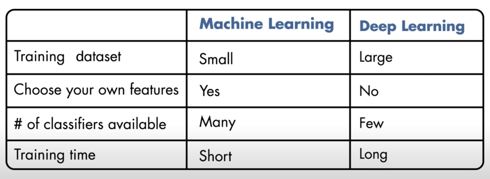

# Image Recognition with Python

```
Einav Grinberg, Muhammad Saad Saif, Anna Formaniuk
```

---

## Overview

### Objectives

After completing this tutorial, students will

- Get an understanding of image recognition using Python and related tools
- Learn how to build, train, and utilize an image classifier that can recognize cats and dogs

### Steps

**Total duration:** 50-60 minutes

- Basic introduction to Python - 5 minutes
- [Introduction to image recognition and selected tools](#introduction-to-image-recognition-and-selected-tools) - 5 minutes
- Setting-up the development environment - 5 minutes
- Importing and preparing the data - 5 minutes
- Compiling and training the model - 10 minutes
- Visualizing the training results - 5 minutes
- Using the model to predict classes for new images - 5 minutes
- Tasks - 10-15 minutes

---

## Introduction to image recognition and selected tools

To recognize an image, human brain has learnt from the vast number of past experiences of looking at the objects that we can recognize. Humans develop this ability to classify an image and tell whether there is a dog or a cat in an image. For a computer, however, this is a complex tasks until they are learnt to tell the difference between the two. Machine and Deep learning both provide ways for computers to classify data such as images. In order to classify images, a model is trained with the sample/training images using Machine or Deep learning based models. 

### Machine Learning vs. Deep Learning For Image Classification
A valid question that arise here is should one use a Machine Learning based model or a Deep Learning based model? The answer to this question is better explained in [this video](https://www.youtube.com/watch?v=-SgkLEuhfbg).

The basic idea is that, in machine learning, we take many pictures of cats and dogs and come up with an algorithm to extract some features (e.g., edges, corners, etc) from within the images. This is called Feature Selection and there is a whole lots of ways to do that. Once we have extracted the features from the images, we train one of the machine learning models such as Support Vector Machines (SVM), k-nearest neighbor (kNN), and others using the extracted features. Once the model is trained, it knows how to classify dogs and cats and it can take any new (previously unseen) picture to analyze and classify them. The following image illustrated the process using machine learning.


While in deep learning, which is a sub-discipline of machine learning, training images can be directly def into the model or a network. The model extracts the features from the images on its own to learn to classify the images, as shown in the below image. 


With that important difference between machine and deep learning for image classification in mind, the question is which one should be used and under what circumstances.

#### Choosing Between Machine or Deep Learning

The decision comes down to the following two questions

- How big is the dataset?
- How much hardware resources are available? 

Typically, a deep learning based algorithm consumes a lot of hardware resources (GPUs) in order to extract the features from the images and learn from them. This is comparatively done with relatively large datasets than machine learning based models and also takes more time to train the model.

Therefore, if there is a less data and less hardware resources for deep learning, a machine learning based approach is more suitable, otherwise the deep learning based approach can also be considered.

Following image helps in choosing which one to use.

