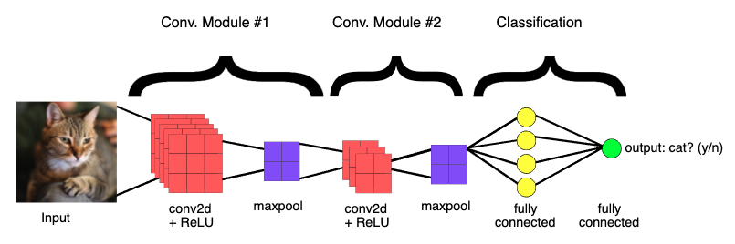

# Image Recognition with Python

```
Einav Grinberg, Muhammad Saad Saif, Anna Formaniuk
```

---

## TODO: Rephrase the whole thing to simplify for the high-school students and to avoid plagiarism ;)

## Overview

### Objectives

After completing this tutorial, readers will

- Get an understanding of image recognition using Python and related tools
- Learn how to build, train, and utilize an image classifier that can recognize cats and dogs

### Steps

**Total duration:** 50-60 minutes

- [Introduction to image recognition and selected tools](#introduction-to-image-recognition-and-selected-tools) - 5 minutes
- Working of Convolutional Neural Network (CNN) for Image Classification - 10 minutes
- Setting-up the development environment - 5 minutes
- Importing and preparing the data - 5 minutes
- Compiling and training the model - 10 minutes
- Visualizing the training results - 5 minutes
- Using the model to predict classes for new images - 5 minutes
- Tasks - 10-15 minutes

---

## Image Classification before Machine Learning

Early computer vision models relied on raw pixel data as the input to the model. However, as shown in Figure 2, raw pixel data alone doesn't provide a sufficiently stable representation to encompass the myriad variations of an object as captured in an image. The position of the object, background behind the object, ambient lighting, camera angle, and camera focus all can produce fluctuation in raw pixel data; these differences are significant enough that they cannot be corrected for by taking weighted averages of pixel RGB values.


To model objects more flexibly, classic computer vision models added new features derived from pixel data, such as color histograms, textures, and shapes. The downside of this approach was that feature engineering became a real burden, as there were so many inputs to tweak. For a cat classifier, which colors were most relevant? How flexible should the shape definitions be? Because features needed to be tuned so precisely, building robust models was quite challenging, and accuracy suffered.


## Introduction to image recognition and selected tools

**How would you describe an image to someone or someone who is blind?**

- **Easy:** Using words that you may know
- **Medium:** From geometric primitives (lines, curves, shape, color, etc.)
- **Difficult:** From the raw pixels

Well, just train a Neural Network :)

To recognize an image, human brain has learnt from the vast number of past experiences of looking at the objects that we can recognize. Humans develop this ability to classify an image and tell whether there is a dog or a cat in the image. Computers only "see" images as the amount of red, blue, and green at each pixel. Everything else we want them to know, we would have had to describe in terms of pixels.

Artificial intelligence takes a different approach. Instead of providing instructions, we provide examples. Above, we could show our robot thousands of labeled images of bread and thousands of labeled images of other objects and ask our robot to learn the difference. Our robot could then build its own program to identify new groups of pixels (images) as bread.

Machine and Deep learning both provide ways for computers to classify data such as images. In order to classify images, a model is trained with the sample/training images using Machine or Deep learning based models. 

**What is model anyway?**: In traditional programming your code compiles into a binary that is typically called a program. In machine learning, the item you create from the data and labels is called a model. In short, a model is a trained neural network which is trained using the provided labeled/unlabeled data. For image classification, we already have the labels of training images i.e., it is a supervised learning problem rather than an unsupervised one. We deal only with labeled data and supervised learning here.

### Machine Learning vs. Deep Learning For Image Classification
A valid question that arise here is should one use a Machine Learning based model or a Deep Learning based model? The answer to this question is better explained in [this video](https://www.youtube.com/watch?v=-SgkLEuhfbg).

The basic idea is that, in machine learning, we take many pictures of cats and dogs and come up with an algorithm to extract some features (e.g., edges, corners, etc) from within the images. This is called Feature Selection and there is a whole lots of ways to do that. Once we have extracted the features from the images, we train one of the machine learning models such as Support Vector Machines (SVM), k-nearest neighbor (kNN), and others using the extracted features. Once the model is trained, it knows how to classify dogs and cats and it can take any new (previously unseen) picture to analyze and classify them. The following image illustrated the process using machine learning.


While in deep learning, which is a sub-discipline of machine learning, training images can be directly def into the model or a network. The model extracts the features from the images on its own to learn to classify the images, as shown in the below image. 


Another way to understand the difference is using the below figure which is stating the same difference with different visuals.


With that important difference between machine and deep learning for image classification in mind, the question is which one should be used and under what circumstances.

#### Choosing Between Machine or Deep Learning

The decision comes down to the following two questions

- How big is the dataset?
- How much hardware resources are available? 

Typically, a deep learning based algorithm consumes a lot of hardware resources (GPUs) in order to extract the features from the images and learn from them. This is comparatively done with relatively large datasets than machine learning based models and also takes more time to train the model.

Therefore, if there is a less data and less hardware resources for deep learning, a machine learning based approach is more suitable, otherwise the deep learning based approach can also be considered.

Following image helps in choosing which one to use.


### TensorFlow for Machine and Deep Learning

We will perform image classification using the following tools:

- TensorFlow - an end-to-end open source platform for machine learning.
- Jupyter Notebook - an open-source application that allows to create and share documents that contain live code, equations, visualizations and narrative text.
- Google Colaboratory - a browser-based environment that allows you to write and execute Python in your browser. Colab notebooks are Jupyter notebooks that are hosted by Colab
- Python 3 - preferred programming language for machine learning with TensorFlow
- Keras - a high-level deep-learning API for configuring neural networks.
- Other libraries - such as Numpy, Pandas, and Matplotlib etc.

We will perform everything in the browser so you do not have to install or perform any kind of setup on your laptop.

For a beginners guide about machine learning using TensorFlow, go through this Hello World tutorial https://codelabs.developers.google.com/codelabs/tensorflow-lab1-helloworld/#0


## Working of Convolutional Neural Network (CNN) for Image Classification 

A breakthrough in building models for image classification came with the discovery that a convolutional neural network (CNN) could be used to progressively extract higher- and higher-level representations of the image content. Instead of preprocessing the data to derive features like textures and shapes, a CNN takes just the image's raw pixel data as input and "learns" how to extract these features, and ultimately infer what object they constitute.

To start, the CNN receives an input feature map: a three-dimensional matrix where the size of the first two dimensions corresponds to the length and width of the images in pixels. The size of the third dimension is 3 (corresponding to the 3 channels of a color image: red, green, and blue). The CNN comprises a stack of modules, each of which performs three operations.

### 1. Convolution
A convolution extracts tiles of the input feature map, and applies filters to them to compute new features, producing an output feature map, or convolved feature (which may have a different size and depth than the input feature map). Convolutions are defined by two parameters:

- Size of the tiles that are extracted (typically 3x3 or 5x5 pixels).
- The depth of the output feature map, which corresponds to the number of filters that are applied.

During a convolution, the filters (matrices the same size as the tile size) effectively slide over the input feature map's grid horizontally and vertically, one pixel at a time, extracting each corresponding tile (see Figure 3).


Figure 3. A 3x3 convolution of depth 1 performed over a 5x5 input feature map, also of depth 1. There are nine possible 3x3 locations to extract tiles from the 5x5 feature map, so this convolution produces a 3x3 output feature map.

For each filter-tile pair, the CNN performs element-wise multiplication of the filter matrix and the tile matrix, and then sums all the elements of the resulting matrix to get a single value. Each of these resulting values for every filter-tile pair is then output in the convolved feature matrix (see Figures 4a and 4b).


Figure 4a. Left: A 5x5 input feature map (depth 1). Right: a 3x3 convolution (depth 1).


Figure 4b. Left: The 3x3 convolution is performed on the 5x5 input feature map. Right: the resulting convolved feature. Click on a value in the output feature map to see how it was calculated.

During training, the CNN "learns" the optimal values for the filter matrices that enable it to extract meaningful features (textures, edges, shapes) from the input feature map. As the number of filters (output feature map depth) applied to the input increases, so does the number of features the CNN can extract. However, the tradeoff is that filters compose the majority of resources expended by the CNN, so training time also increases as more filters are added. Additionally, each filter added to the network provides less incremental value than the previous one, so engineers aim to construct networks that use the minimum number of filters needed to extract the features necessary for accurate image classification.

### 2. ReLU

Following each convolution operation, the CNN applies a Rectified Linear Unit (ReLU) transformation to the convolved feature, in order to introduce nonlinearity into the model. The ReLU function, , returns x for all values of x > 0, and returns 0 for all values of x ≤ 0.

### 3. Pooling
After ReLU comes a pooling step, in which the CNN downsamples the convolved feature (to save on processing time), reducing the number of dimensions of the feature map, while still preserving the most critical feature information. A common algorithm used for this process is called max pooling.

Max pooling operates in a similar fashion to convolution. We slide over the feature map and extract tiles of a specified size. For each tile, the maximum value is output to a new feature map, and all other values are discarded. Max pooling operations take two parameters:

- Size of the max-pooling filter (typically 2x2 pixels)
- Stride: the distance, in pixels, separating each extracted tile. Unlike with convolution, where filters slide over the feature map pixel by pixel, in max pooling, the stride determines the locations where each tile is extracted. For a 2x2 filter, a stride of 2 specifies that the max pooling operation will extract all nonoverlapping 2x2 tiles from the feature map (see Figure 5).


Figure 5. Left: Max pooling performed over a 4x4 feature map with a 2x2 filter and stride of 2. Right: the output of the max pooling operation. Note the resulting feature map is now 2x2, preserving only the maximum values from each tile.

### Fully Connected Layers
At the end of a convolutional neural network are one or more fully connected layers (when two layers are "fully connected," every node in the first layer is connected to every node in the second layer). Their job is to perform classification based on the features extracted by the convolutions. Typically, the final fully connected layer contains a softmax activation function, which outputs a probability value from 0 to 1 for each of the classification labels the model is trying to predict.

Figure 6 illustrates the end-to-end structure of a convolutional neural network.


Figure 6. The CNN shown here contains two convolution modules (convolution + ReLU + pooling) for feature extraction, and two fully connected layers for classification. Other CNNs may contain larger or smaller numbers of convolutional modules, and greater or fewer fully connected layers. Engineers often experiment to figure out the configuration that produces the best results for their model.

## Setting-up the development environment
Make a video/screen-recording of setting up a mac and windows and run the basic code example