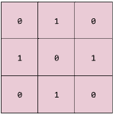

## Machine Learning Glossary

This section briefly explains all the terminologies used in this tutorial. Most of the terminologies are directly taken from [here](https://developers.google.com/machine-learning/glossary)

### Tensor
The primary data structure in TensorFlow programs. Tensors are N-dimensional (where N could be very large) data structures, most commonly scalars, vectors, or matrices. The elements of a Tensor can hold integer, floating-point, or string values.

### neuron
A node in a neural network, typically taking in multiple input values and generating one output value. The neuron calculates the output value by applying an activation function (nonlinear transformation) to a weighted sum of input values.

### neural network
A model that, taking inspiration from the brain, is composed of layers (at least one of which is hidden) consisting of simple connected units or neurons followed by nonlinearities.

### hidden layer
A synthetic layer in a neural network between the input layer (that is, the features) and the output layer (the prediction). Hidden layers typically contain an activation function (such as ReLU) for training. A deep neural network contains more than one hidden layer.

### weight
A coefficient for a feature in a linear model, or an edge in a deep network. The goal of training a linear model is to determine the ideal weight for each feature. If a weight is 0, then its corresponding feature does not contribute to the model.

### Activation Function
A function (for example, ReLU or sigmoid) that takes in the weighted sum of all of the inputs from the previous layer and then generates and passes an output value (typically nonlinear) to the next layer.

### Rectified Linear Unit (ReLU)
An activation function with the following rules:

- If input is negative or zero, output is 0.
- If input is positive, output is equal to input.

### Sigmoid function
A function that maps logistic or multinomial regression output (log odds) to probabilities, returning a value between 0 and 1.

### Convolution
In mathematics, casually speaking, a mixture of two functions. In machine learning, a convolution mixes the convolutional filter and the input matrix in order to train weights.

The term "convolution" in machine learning is often a shorthand way of referring to either convolutional operation or convolutional layer.

### convolutional filter
One of the two actors in a convolutional operation. (The other actor is a slice of an input matrix.) A convolutional filter is a matrix having the same rank as the input matrix, but a smaller shape. For example, given a 28x28 input matrix, the filter could be any 2D matrix smaller than 28x28.

### Convolutional layer
A layer of a deep neural network in which a convolutional filter passes along an input matrix. For example, consider the following 3x3 convolutional filter:

The following animation shows a convolutional layer consisting of 9 convolutional operations involving the 5x5 input matrix. Notice that each convolutional operation works on a different 3x3 slice of the input matrix. The resulting 3x3 matrix (on the right) consists of the results of the 9 convolutional operations:

### Convolutional Neural Network
A neural network in which at least one layer is a convolutional layer. A typical convolutional neural network consists of some combination of the following layers:
- convolutional layers
- pooling layers
- dense layers

Convolutional neural networks have had great success in certain kinds of problems, such as image recognition.